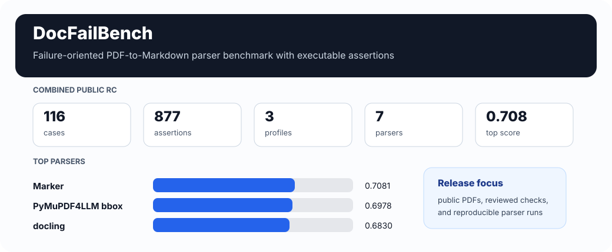
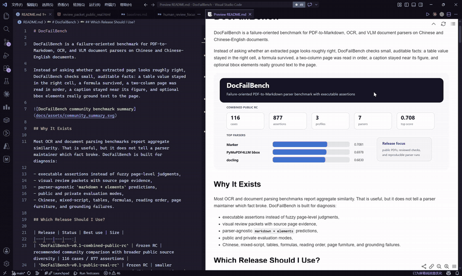
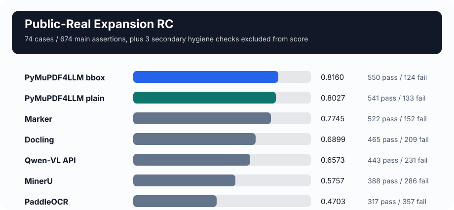
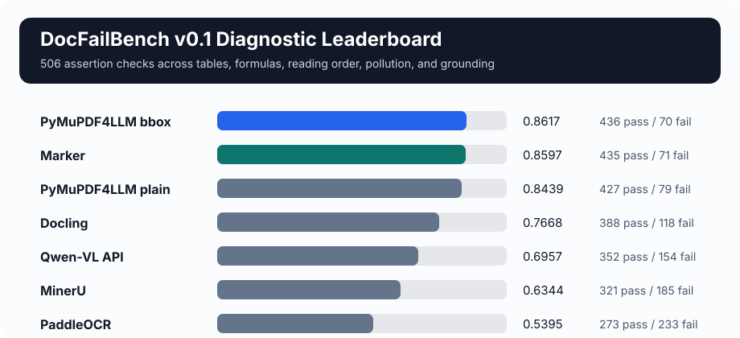
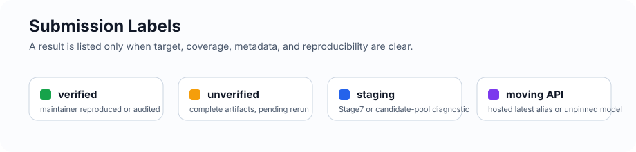
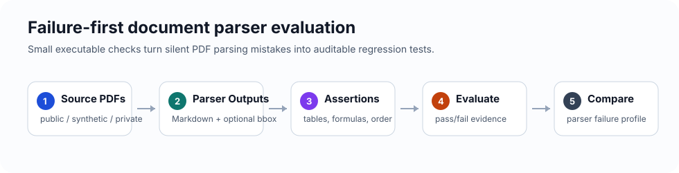
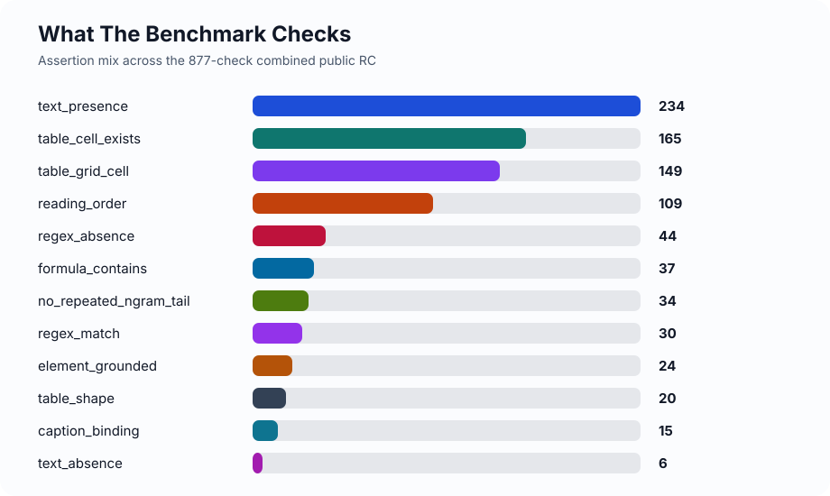
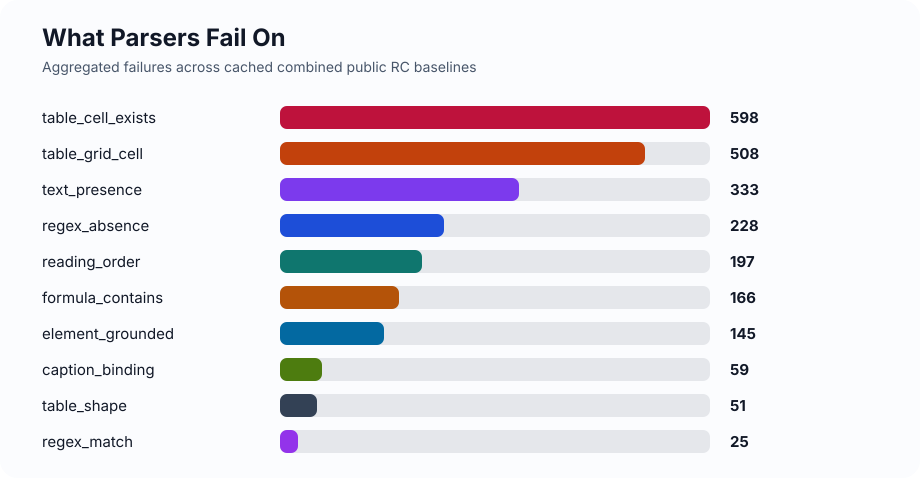
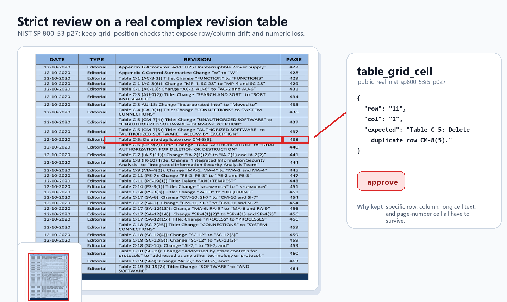
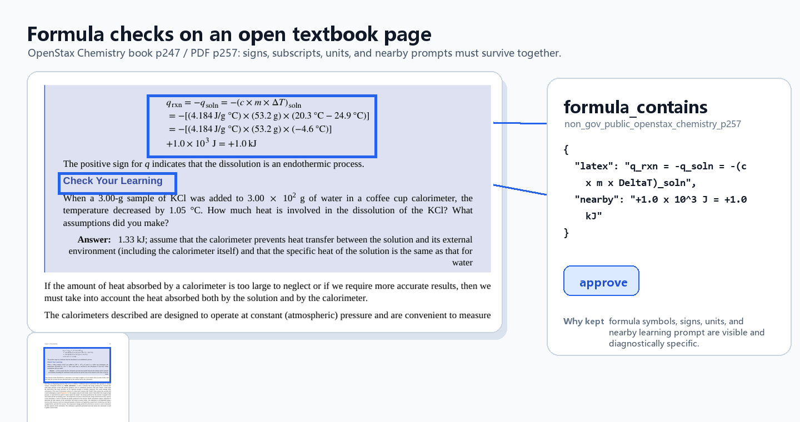

# DocFailBench

DocFailBench is a failure-oriented benchmark for PDF-to-Markdown, OCR, and VLM document parsers on Chinese and Chinese-English documents.

Instead of asking whether an extracted page looks roughly right, DocFailBench checks small, auditable facts: a table value stayed in the right cell, a formula survived, a two-column page was read in order, a caption stayed near its figure, and optional bbox elements really ground text to the page.





_Demo: inspect a review packet, mark assertion decisions, and run a parser compare from the release artifacts._

## Why It Exists

Most OCR and document parsing benchmarks report aggregate similarity. That is useful, but it does not tell a parser maintainer which fact broke. DocFailBench is built for diagnosis:

- executable assertions instead of fuzzy page-level judgments,
- visual review packets with source page evidence,
- parser-agnostic `markdown + elements` predictions,
- public and private evaluation modes,
- Chinese, mixed-script, tables, formulas, reading order, page furniture, and grounding failures.

## Which Release Should I Use?

| Release | Status | Best use | Size |
|---|---|---|---:|
| `DocFailBench-v0.1-combined-public-rc` | frozen RC | recommended community comparison with broader public source diversity | 116 cases / 877 assertions |
| `DocFailBench-v0.1-hosted-safe-rc` | frozen auxiliary RC | hosted parsers using identical hash-pinned one-page inputs | 107 cases / 821 assertions / 105 PDFs |
| `DocFailBench-v0.1-public-real-rc` | frozen RC | smaller public-real comparison target | 74 cases / 674 main assertions |
| `DocFailBench-v0.1-non-gov-public-stage7-rc` | frozen auxiliary RC | non-government public PDF stress test | 24 cases / 165 assertions |
| `DocFailBench-v0.1-diagnostic` | frozen RC | local regression and failure analysis | 54 cases / 506 assertions |
| Stage8 non-government batch2 | included audit input | second-reviewed contribution to the combined RC; original staging files kept for audit | 18 cases / 38 accepted assertions |

For local parser submissions, use `DocFailBench-v0.1-combined-public-rc` unless
you need the smaller public-real RC for a faster comparison. Hosted services
that would otherwise fetch source URLs should use the hosted-safe auxiliary
target and its canonical page bundle.

## Hosted-Safe RC

`DocFailBench-v0.1-hosted-safe-rc` is an additive track for hosted parsers. It
keeps the original 116-case / 877-assertion combined RC unchanged, excludes nine
redistribution-policy cases, and publishes 105 content-addressed one-page PDFs
for the remaining 107 cases / 821 assertions. Prepared inputs always use the
same verified bytes and `page=1`.

- [Hosted-safe submission and retry protocol](docs/hosted-safe-submissions.md)
- [Hosted-safe cases](data/releases/docfailbench_v0_1_hosted_safe_rc_cases.json)
- [Hosted-safe leaderboard](data/releases/docfailbench_v0_1_hosted_safe_rc_leaderboard.md)
- [Hosted-safe source manifest](data/releases/docfailbench_v0_1_hosted_safe_rc_source_manifest.json)
- [Hosted-safe artifact manifest](data/releases/docfailbench_v0_1_hosted_safe_rc_manifest.json)

Verify the seven cached hosted-safe scores:

```powershell
powershell -ExecutionPolicy Bypass -File scripts\run_hosted_safe_compare.ps1
```

## Combined Public RC Leaderboard

`DocFailBench-v0.1-combined-public-rc` is the recommended community-facing
target. It keeps the public-real RC as the largest profile, then adds the
frozen Stage7 non-government structural track and the second-reviewed Stage8
non-government expansion.

- 116 cases / 877 assertions
- 7 cached parser baselines
- Profile labels preserved: `public_real_rc`, `non_gov_stage7_structural`,
  `non_gov_stage8_reviewed`
- Ulang `deepseek-ocr2` is not included because authenticated image smoke tests
  returned upstream 500 errors on 2026-05-09

| Parser | Passed | Failed | Score |
|---|---:|---:|---:|
| Marker | 621 | 256 | 0.7081 |
| PyMuPDF bbox | 612 | 265 | 0.6978 |
| Docling | 599 | 278 | 0.6830 |
| PyMuPDF plain | 589 | 288 | 0.6716 |
| Qwen-VL API (`qwen-vl-ocr-latest`, run 2026-05) | 559 | 318 | 0.6374 |
| MinerU | 496 | 381 | 0.5656 |
| PaddleOCR | 334 | 543 | 0.3808 |

Frozen combined artifacts:

- [combined RC card](data/releases/docfailbench_v0_1_combined_public_rc_card.md)
- [release notes](docs/release-notes-v0.1-combined-public-rc.md)
- [cases](data/releases/docfailbench_v0_1_combined_public_rc_cases.json)
- [leaderboard](data/releases/docfailbench_v0_1_combined_public_rc_leaderboard.md)
- [source manifest](data/releases/docfailbench_v0_1_combined_public_rc_source_manifest.md)
- [artifact manifest](data/releases/docfailbench_v0_1_combined_public_rc_manifest.json)

Verify the cached release scores from frozen predictions:

```powershell
powershell -ExecutionPolicy Bypass -File scripts\run_combined_public_compare.ps1
```

## Public-Real RC Leaderboard

`DocFailBench-v0.1-public-real-rc` freezes the first strict-reviewed real-public PDF expansion on top of the diagnostic set.

- 7 official public PDFs
- 20 strict-reviewed public pages
- 168 public-real assertions, plus 3 secondary hygiene checks excluded from score
- 74 merged cases / 674 main assertions
- 7 cached parser baselines with parser metadata



| Parser | Passed | Failed | Score |
|---|---:|---:|---:|
| PyMuPDF4LLM bbox | 550 | 124 | 0.8160 |
| PyMuPDF4LLM plain | 541 | 133 | 0.8027 |
| Marker | 522 | 152 | 0.7745 |
| Docling | 465 | 209 | 0.6899 |
| Qwen-VL API (`qwen-vl-ocr-latest`, run 2026-05) | 443 | 231 | 0.6573 |
| MinerU | 388 | 286 | 0.5757 |
| PaddleOCR | 317 | 357 | 0.4703 |

Frozen artifacts:

- [public-real RC card](data/releases/docfailbench_v0_1_public_real_rc_card.md)
- [cases](data/releases/docfailbench_v0_1_public_real_rc_cases.json)
- [leaderboard](data/releases/docfailbench_v0_1_public_real_rc_leaderboard.md)
- [public-only leaderboard](data/releases/docfailbench_v0_1_public_real_rc_public_only_leaderboard.md)
- [secondary hygiene cases](data/releases/docfailbench_v0_1_public_real_rc_hygiene_cases.json)
- [parser metadata](data/releases/docfailbench_v0_1_public_real_rc_metadata.json)
- [spot-check report](data/releases/docfailbench_v0_1_public_real_rc_spotcheck.md)
- [artifact manifest](data/releases/docfailbench_v0_1_public_real_rc_manifest.json)

Scores are computed from frozen case files and cached prediction artifacts.
Parser/runtime metadata and spot-check notes are linked above. For community
evaluation, cached-score checks, and maintainer-only artifact rebuilds, see
[docs/reproducibility-public-real-rc.md](docs/reproducibility-public-real-rc.md).

## Diagnostic Release

`DocFailBench-v0.1-diagnostic` is the older local regression set. It is synthetic-heavy by design and useful for controlled failure analysis.
Use the combined public RC above for new community parser submissions.



| Parser | Passed | Failed | Score |
|---|---:|---:|---:|
| PyMuPDF4LLM bbox | 436 | 70 | 0.8617 |
| Marker | 435 | 71 | 0.8597 |
| PyMuPDF4LLM plain | 427 | 79 | 0.8439 |
| Docling | 388 | 118 | 0.7668 |
| Qwen-VL API (`qwen-vl-ocr-latest`, run 2026-05) | 352 | 154 | 0.6957 |
| MinerU | 321 | 185 | 0.6344 |
| PaddleOCR | 273 | 233 | 0.5395 |

Artifacts: [benchmark card](docs/benchmark-card-v0.1.md), [cases](data/releases/docfailbench_v0_1_diagnostic_cases.json), [leaderboard](data/releases/docfailbench_v0_1_diagnostic_leaderboard.md).

## Non-Government Public RC

`DocFailBench-v0.1-non-gov-public-stage7-rc` freezes the reviewed Stage7 non-government public subset. It expands source diversity with OpenStax, ACL Anthology, PMC/PeerJ, Frontiers, and BioMed Central pages.

Treat it as an auxiliary track, not a standalone replacement for the combined
public RC. It is stronger for academic/table/textbook layouts but smaller; in
the combined target, it is reported with its profile label preserved.

| Set | Scope | Status |
|---|---:|---|
| Stage7 strict reviewed set | 23 pages / 44 assertions | staging audit subset |
| Stage7 structural-v2 RC | 24 pages / 165 assertions | frozen auxiliary RC |
| Stage8 batch2 | 24 pages / 181 candidates; 38 accepted assertions | second-review accepted, 7-parser baselined, included in combined RC |

Stage7 cached comparisons remain useful as a second leaderboard axis. In the
combined RC, Stage7 and Stage8 keep separate profile labels so the aggregate
score does not hide source-family behavior.

Stage7 artifacts: [progress report](runs/stage7_non_gov_public/non_gov_public_progress_report.md), [strict compare](runs/stage7_non_gov_public/compare_reviewed_7parser.md), [structural-v2 compare](runs/stage7_non_gov_public/compare_structural_v2_7parser.md), [next public PDF queue](docs/public-pdf-next-batch-queue.md).

Frozen Stage7 RC artifacts:
[card](data/releases/docfailbench_v0_1_non_gov_public_stage7_rc_card.md),
[cases](data/releases/docfailbench_v0_1_non_gov_public_stage7_rc_cases.json),
[leaderboard](data/releases/docfailbench_v0_1_non_gov_public_stage7_rc_leaderboard.md),
[manifest](data/releases/docfailbench_v0_1_non_gov_public_stage7_rc_manifest.json).

Stage8 batch2 started as a strict, second-review accepted staging subset and is
now included in `DocFailBench-v0.1-combined-public-rc`. The original Stage8
files remain audit artifacts. Its 38 accepted checks have cached 7-parser
diagnostics:

| Parser | Passed | Failed | Score |
|---|---:|---:|---:|
| PyMuPDF bbox | 30 | 8 | 0.7895 |
| PyMuPDF plain | 23 | 15 | 0.6053 |
| Marker | 9 | 29 | 0.2368 |
| Qwen-VL API (`qwen-vl-ocr-latest`, run 2026-05) | 8 | 30 | 0.2105 |
| Docling | 7 | 31 | 0.1842 |
| MinerU | 6 | 32 | 0.1579 |
| PaddleOCR | 5 | 33 | 0.1316 |

Stage8 artifacts:
[first review](runs/stage8_non_gov_public_batch2/stage8_codex_first_review.md),
[human second-review acceptance](runs/stage8_non_gov_public_batch2/stage8_human_second_review_accepted.md),
[7-parser compare](runs/stage8_non_gov_public_batch2/compare_stage8_second_review_7parser.md),
[staging manifest](runs/stage8_non_gov_public_batch2/stage8_staging_manifest.md),
[source/license manifest](runs/stage8_non_gov_public_batch2/stage8_source_license_manifest.md),
[parser metadata](runs/stage8_non_gov_public_batch2/stage8_parser_metadata.md).

## Quick Start

Evaluate a prediction file against the recommended combined public RC:

```powershell
python -m docfailbench.cli evaluate `
  --cases data/releases/docfailbench_v0_1_combined_public_rc_cases.json `
  --predictions path/to/your_predictions.json `
  --out runs/submissions/YOUR_PARSER/combined_public_rc_results.json
```

Run a parser adapter end to end:

```powershell
python -m docfailbench.cli baseline `
  --manifest examples/parser_manifest.json `
  --parser pymupdf4llm `
  --cases data/releases/docfailbench_v0_1_combined_public_rc_cases.json `
  --out runs/combined_public_rc_rerun/pymupdf4llm/predictions.json `
  --results runs/combined_public_rc_rerun/pymupdf4llm/results.json `
  --html runs/combined_public_rc_rerun/pymupdf4llm/report.html
```

Run the small built-in smoke sample:

```powershell
python -m docfailbench.cli evaluate `
  --cases data/cases/sample_cases.json `
  --predictions data/predictions/sample_parser_predictions.json `
  --out runs/sample/results.json `
  --html runs/sample/report.html
```

Open the HTML report in a browser to inspect source metadata, parser Markdown, assertion results, and evidence.

## Prediction Format

A parser submission is a JSON file with one prediction per case:

```json
{
  "case_id": "public_real_nist_ai_rmf_p017",
  "parser": "your_parser_name",
  "markdown": "extracted Markdown or text",
  "elements": [
    {
      "type": "text",
      "text": "optional spatially grounded text",
      "bbox": [72, 100, 300, 140]
    }
  ],
  "metadata": {
    "version": "1.2.3",
    "command": "your reproducible command"
  }
}
```

`elements` may be empty. Parsers with bbox or polygon elements can pass bbox-aware `element_grounded` checks; plain Markdown parsers are expected to fail them.

## Submit Parser Results

Open an issue or PR with:

- parser name, version, and installation notes,
- exact command or adapter manifest entry,
- prediction JSON and result JSON,
- OS, Python/runtime, GPU if used,
- API endpoint family, model name, and run date for hosted models,
- machine-readable per-case wrapper metadata for API results, including
  requested model, endpoint host, status, and elapsed time when available,
- any known caveats such as OCR-only output or no bbox support.

See [docs/submitting-parser-results.md](docs/submitting-parser-results.md) for the full submission flow.
Hosted parser authors should also follow [docs/hosted-safe-submissions.md](docs/hosted-safe-submissions.md).
For a concrete metadata example, see [docs/parser-result-submission-example.md](docs/parser-result-submission-example.md).



## How It Works



Each case contains executable assertions. During evaluation, a parser prediction is normalized into Markdown plus optional spatial elements, and each assertion returns pass/fail evidence.

Common assertion types include:

- `table_cell_exists`: a visible value must remain table-cell-like,
- `table_grid_cell`: a value must stay at a specific row and column,
- `formula_contains`: a formula fragment must survive normalization,
- `reading_order`: two page-local anchors must appear in the expected order,
- `caption_binding`: a caption must stay near its figure or table anchor,
- `element_grounded`: optional bbox/poly elements must ground text to the page,
- `regex_absence` / `text_absence`: page furniture and pollution checks.





## Review Examples

The review packet keeps assertions that are visible, specific, and diagnostic. For public tables, grid-position checks are preferred over easy headers:



For formulas, concise symbol-level checks are kept when they test structure that plain text similarity can miss:



## Scope And Limits

DocFailBench is strongest as a diagnostic parser benchmark. It should not be used as the sole basis for broad OCR quality claims, model training suitability, or production accuracy across all document types.

Current limitations:

- the combined RC is still small enough to be diagnostic, not a population-scale OCR benchmark,
- the public-real profile is government-source heavy, while non-government profiles are smaller,
- `element_grounded` checks bbox existence, not exact gold-region overlap,
- hosted VLM results can drift when providers update `latest` models,
- there is no hosted leaderboard service yet.

## Local And Private Use

Private mode keeps aggregate scores and failure taxonomy counts, but redacts assertion text, Markdown, elements, paths, messages, and evidence payloads:

```powershell
python -m docfailbench.cli evaluate `
  --cases data/cases/sample_cases.json `
  --predictions data/predictions/sample_parser_predictions.json `
  --out runs/private/results.private.json `
  --private `
  --private-profile runs/private/profile.json
```

Private mode rejects `--html` and `--raw-dir`, because those outputs can contain page images, parser Markdown, bboxes, metadata, or source excerpts.

## Repository Map

```text
docfailbench/            assertion handlers, evaluator, adapters, reports
examples/                parser manifest and parser wrapper examples
data/releases/           frozen release artifacts and leaderboards
data/cases/              development and diagnostic case files
docs/                    benchmark cards, source policy, submission guides
runs/stage7_non_gov_public/  non-government public RC audit workspace
runs/stage8_non_gov_public_batch2/  combined RC audit workspace
tests/                   unit and integration tests
```

Key docs:

- [Combined release gate](docs/combined-release-gate.md)
- [Combined RC release notes](docs/release-notes-v0.1-combined-public-rc.md)
- [Public-real RC reproducibility](docs/reproducibility-public-real-rc.md)
- [Parser result submission](docs/submitting-parser-results.md)
- [Hosted-safe parser submission](docs/hosted-safe-submissions.md)
- [Parser baselines and API model settings](docs/baselines.md)
- [Parser submission example](docs/parser-result-submission-example.md)
- [Public PDF source plan](docs/public-pdf-sources.md)
- [Next public PDF queue](docs/public-pdf-next-batch-queue.md)
- [Development status](docs/development-status.md)
- [Agent handoff](CLAUDE.md)

## Roadmap

Stage7 and Stage8 have now been folded into
`DocFailBench-v0.1-combined-public-rc` with profile labels preserved. The next
community-quality step is broader participation and source diversity:

1. keep the one-command cached-score verification script green,
2. gather external parser submissions against the combined target,
3. add 20-40 more non-government public pages for the next release,
4. keep broader page-furniture checks in a secondary hygiene profile,
5. prototype stricter region-overlap checks for `element_grounded`.

Audit artifacts:

- [Stage7 source/license manifest](runs/stage7_non_gov_public/stage7_source_license_manifest.md)
- [Stage7 structural-v2 spot-check preflight](runs/stage7_non_gov_public/structural_v2_spotcheck_preflight.md)
- [Stage7 element-grounded profile](runs/stage7_non_gov_public/stage7_element_grounded_profile.md)
- [Stage8 non-government batch2 report](runs/stage8_non_gov_public_batch2/batch2_progress_report.md)
- [Stage8 first review](runs/stage8_non_gov_public_batch2/stage8_codex_first_review.md)
- [Stage8 second-review acceptance](runs/stage8_non_gov_public_batch2/stage8_human_second_review_accepted.md)
- [Stage8 7-parser compare](runs/stage8_non_gov_public_batch2/compare_stage8_second_review_7parser.md)
- [Stage8 staging manifest](runs/stage8_non_gov_public_batch2/stage8_staging_manifest.md)
- [Stage8 parser metadata](runs/stage8_non_gov_public_batch2/stage8_parser_metadata.md)

Stage8 has been included in `DocFailBench-v0.1-combined-public-rc`; the original
Stage8 staging files remain available as audit artifacts.
